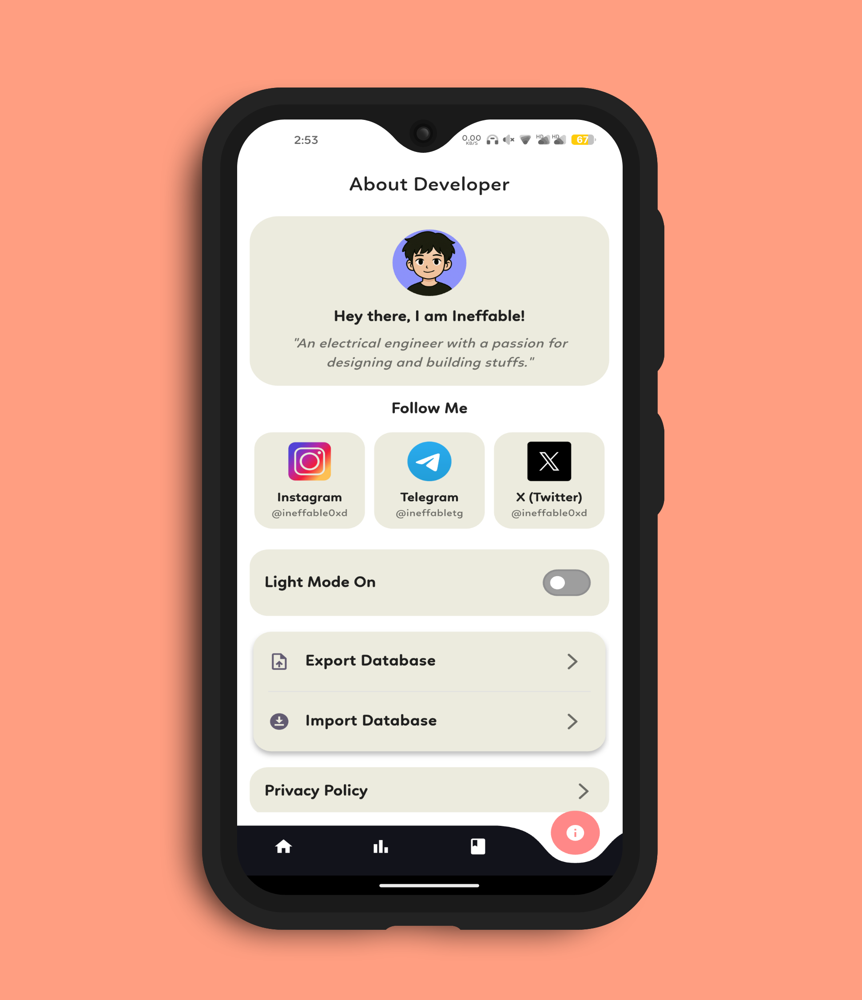
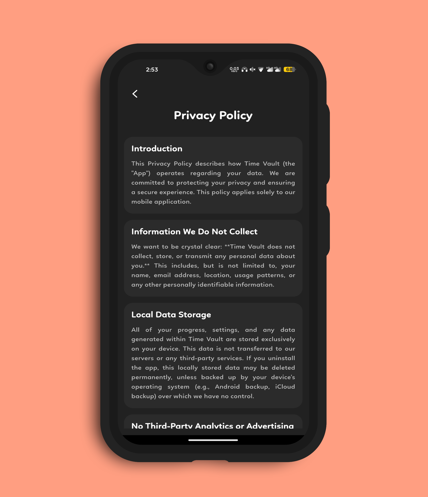
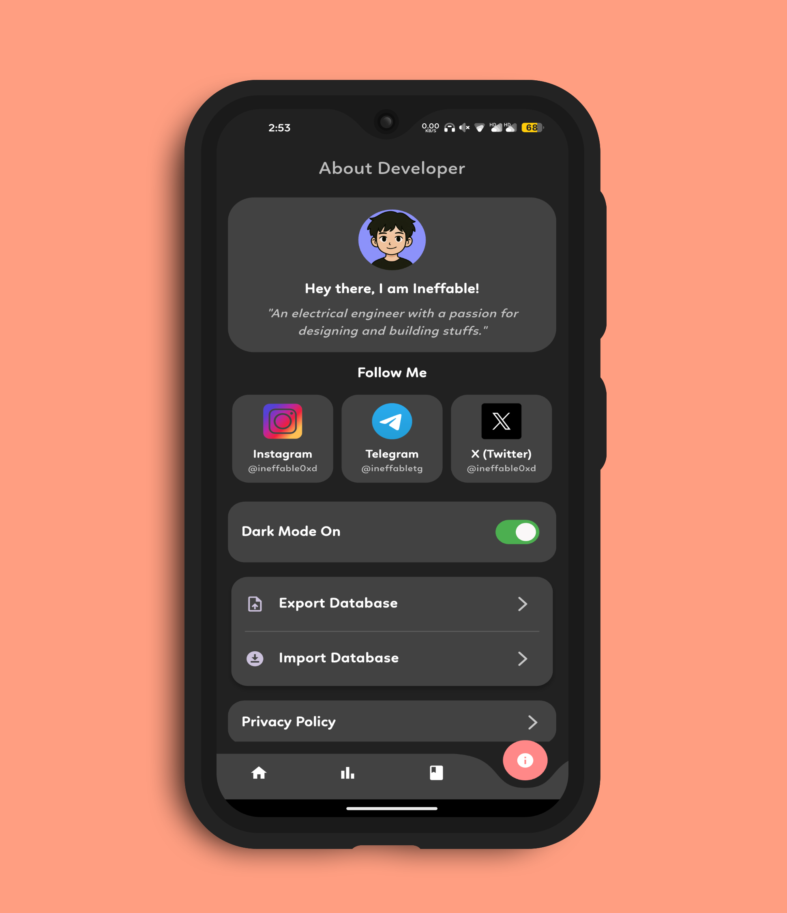
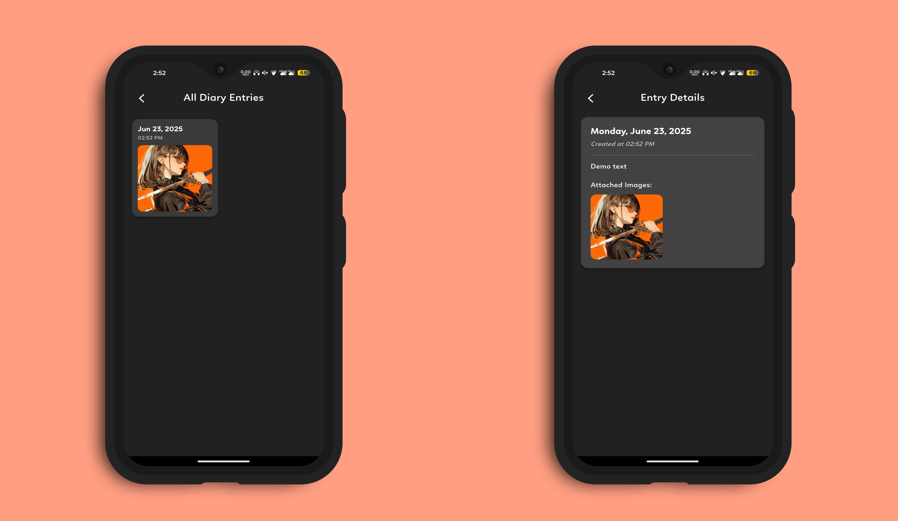
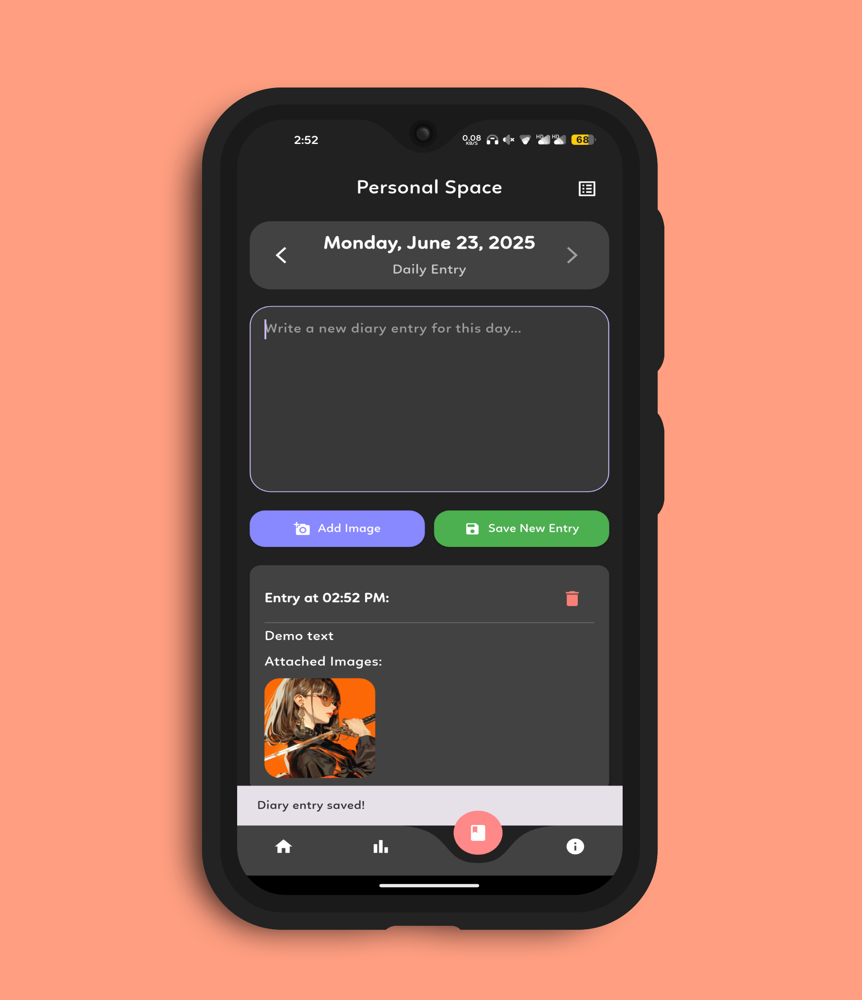
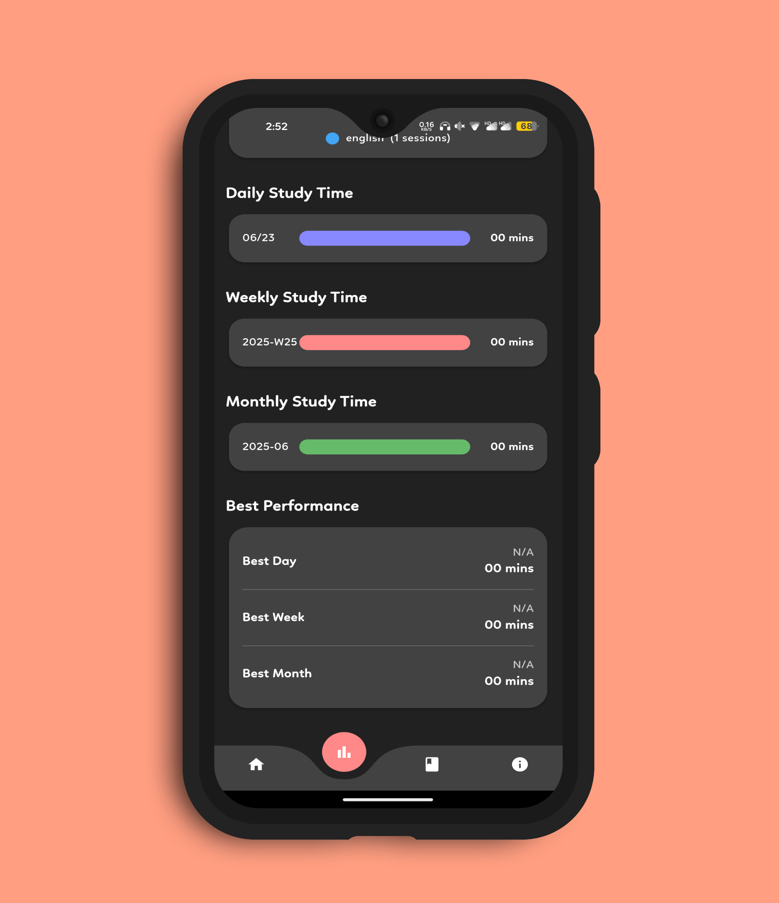
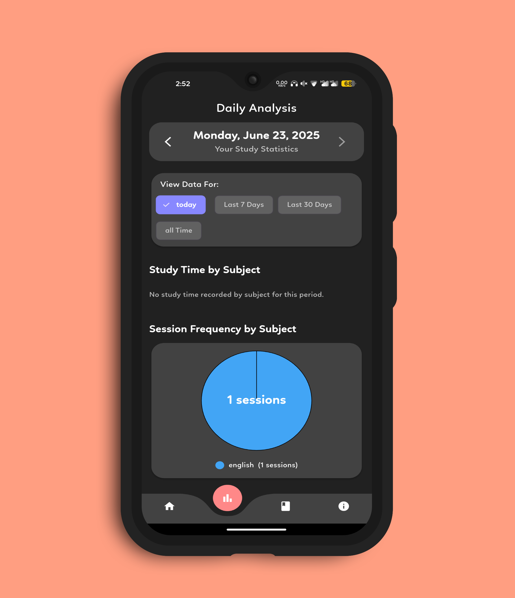
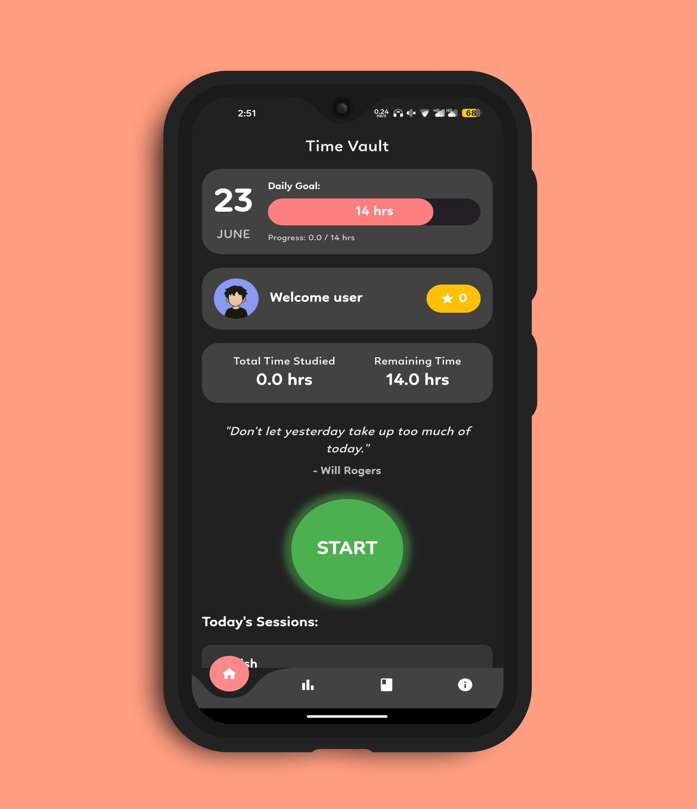

<h1 align="center">⏳ <strong>Time Vault</strong> ⏳</h1>
<h3 align="center">Your Ultimate Study Tracker & Focus Companion</h3>

Built with ❤️ by Ineffable using Flutter – Stay productive, stay inspired.

---

## 📱 What is Time Vault?

**Time Vault** is a beautifully crafted productivity app that helps you **track your focus sessions**, **analyze your progress**, and **stay motivated** through goal-setting and rewards.  
With an integrated **personal diary** and clean UI, it's the ideal companion for students, professionals, or anyone looking to take control of their time.

---

## 🌟 Features in Detail

### 🎯 Daily Goals – *Stay Focused with Purpose*  
Set a personalized daily target for study or focus time (e.g., 4 hours, 6 hours, 8 hours).  
This goal acts as your anchor for the day, helping you build consistent habits.  
A dynamic progress indicator (circular slider) motivates you visually as you get closer to your goal.

---

### ⏱️ Smart Session Timer – *Track Time by Subject*  
Start, pause, resume, or stop focus sessions with a single tap.  
Select the subject you're working on (e.g., Math, History, Coding), and let Time Vault log every second.  
Never lose track of how much time you're investing in each subject.

---

### 📊 Visual Analytics – *Your Time, Beautifully Visualized*  
Understand your focus patterns with intuitive, real-time graphs:
- Daily and weekly session durations  
- Subject-wise time distribution (Pie Chart)  
- Percentage of daily goal completion  
- Total cumulative study time  
These insights help you reflect and optimize your schedule.

---

### 🌟 Star Rewards – *Gamify Your Productivity*  
Earn ⭐️ stars every time you finish a session or reach your daily goal.  
Stars act as positive reinforcement to encourage daily consistency and give a sense of achievement.

---

### 📔 Session Diary – *Write and Reflect*  
Maintain a digital journal of your focus journey:
- Add notes or reflections after each session  
- Attach screenshots, study photos, or doubts ss  
- Look back at past entries to see how far you’ve come  
It’s your personal space to **track both numbers and emotions**.

---

### 👤 Personalized Profile – *Make It Yours*  
Customize your avatar and username to match your identity.  
A minimal profile section gives the app a personal, welcoming feel.

---

### 💬 Motivational Quotes – *Inspiration Every Day*  
Get inspired with randomly displayed motivational quotes on the home screen.  
Boost your focus mindset before each study session.

---

### 🌗 Light & Dark Mode – *Comfort for Every Hour*  
Easily toggle between light and dark themes based on your environment or mood.  
Enjoy a beautiful UI with consistent Material You (M3) design.

---

### 💾 Offline First – *Your Data Stays with You*  
Using **Sembast**, all your session data and preferences are stored locally.  
This ensures privacy, speed, and full offline capability — no account or login needed.

---

<h2 align="center">📸 Previews</h2>

  
  
  

  
  
  

  
  

---

## ⚙️ Built With

- 🧩 Flutter  
- 💡 Dart  
- 🗃 Sembast (local NoSQL database)  
- 🎨 Material Design 3  
